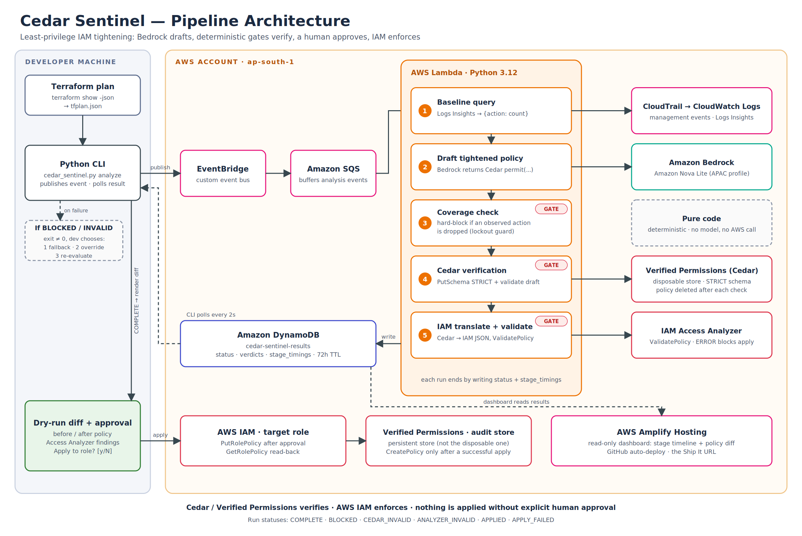

# Cedar Sentinel

> Least-privilege IAM, tightened from real usage, verified, and applied only with your approval.

[](https://community.aws)
[-blue)](#)
[](#)
[](LICENSE)
[](https://main.d3i4xcsmv7sca9.amplifyapp.com)

---

## Quick Links

- 🌐 **Live Dashboard (Amplify):** https://main.d3i4xcsmv7sca9.amplifyapp.com
- 📺 **Demo Video:** [Watch Demonstration (YouTube)](https://www.youtube.com/watch?v=RWHE0VpiZ4A)
- 📝 **AWS Builder Center Post:** [Building Cedar Sentinel — Read Article](https://builder.aws.com/content/3JbM8Pcnay8y9zrzhBRWiCaCwgC/building-cedar-sentinel-an-ai-least-privilege-iam-tightener-that-never-applies-anything-without-your-approval)
- 📐 **Architecture Documentation:** [docs/architecture.md](docs/architecture.md)
- 🤖 **AI Tool Disclosure:** [docs/ai-tool-disclosure.md](docs/ai-tool-disclosure.md)
- 📜 **Attribution Log:** [docs/attribution.md](docs/attribution.md)

---

## 1. Problem Statement

Cloud infrastructure teams routinely deploy broad IAM permissions (such as `s3:*` or wildcard actions) during development to avoid blocking velocity, planning to tighten them before production. In practice, manual policy auditing is tedious, error-prone, and disconnected from deployment pipelines. Static linters flag wildcards but cannot know which permissions workloads actually need at runtime, while over-tightening risks silent application lockouts and breaking production deployments.

---

## 2. What Cedar Sentinel Does

Cedar Sentinel bridges the gap between infrastructure-as-code and runtime activity through a 10-stage automated pipeline:

1. **Extracts Planned IAM Policies:** Reads IAM role policy definitions directly from Terraform plan JSON output (`terraform show -json`).
2. **Queries Historical Telemetry:** Queries CloudWatch Logs Insights across a 7-day lookback window to discover exact API actions invoked by the workload.
3. **Applies Deterministic Lockout Guard:** Extracts observed actions and verifies that necessary workload operations are never dropped.
4. **Synthesizes Cedar Policy:** Uses Amazon Bedrock (Nova Lite) to draft a minimal, human-readable Cedar authorization policy.
5. **Enforces Formal Cedar Verification:** Validates the draft policy in `STRICT` mode against a schema in Amazon Verified Permissions (AVP).
6. **Translates to Minimal IAM JSON:** Converts verified Cedar `permit` statements into standard AWS IAM JSON policy syntax.
7. **Normalizes Action Names:** Deterministically maps CloudTrail event names to valid IAM action identifiers (e.g., `s3:ListBuckets` $\rightarrow$ `s3:ListAllMyBuckets`).
8. **Validates via IAM Access Analyzer:** Executes `ValidatePolicy` (syntax correctness) and `CheckNoNewAccess` (mathematical proof against privilege escalation).
9. **Interactive Human Approval:** Displays an interactive git-style before/after diff in the CLI for explicit developer sign-off (`[y/N]`).
10. **Safe Enforcement & Audit:** Snapshots the prior policy to DynamoDB, applies the tightened policy via `iam:PutRolePolicy`, verifies read-back consistency, and logs the approved policy to a persistent AVP audit store.

---

## 3. Pipeline Architecture



> **Core Distinction:** Cedar and Amazon Verified Permissions **verify** policy syntax and schema correctness; AWS IAM **enforces** live permissions at runtime.

```
Terraform Plan JSON
        │
        ▼
   Python CLI ────────► EventBridge ─────► SQS ─────► Lambda Pipeline Processor
   (--apply)                                            │
                                                        ├─ 1. CloudWatch Logs Insights (7-day usage query)
                                                        ├─ 2. Amazon Bedrock (Nova Lite reasoning)
                                                        ├─ 3. Lockout Coverage Guard (deterministic)
                                                        ├─ 4. Cedar Formal Verification (AVP STRICT schema)
                                                        ├─ 5. IAM Translation & Action Normalization
                                                        └─ 6. IAM Access Analyzer (ValidatePolicy + CheckNoNewAccess)
                                                        │
                                                        ▼
                                                  DynamoDB Table
                                                        │
   CLI Interactive Diff & Approval ◄────────────────────┘
        │
        ├─ [N] Decline ──► Writes DECLINED status (no IAM changes)
        │
        └─ [y] Approve ──► Snapshot previous_policy
                       ──► iam:PutRolePolicy (with backoff)
                       ──► Eventual-consistency read-back verification
                       ──► Record audit policy in persistent AVP store
                       └── Status: APPLIED
```

---

## 4. AWS Services Used & Why

| AWS Service | Role in Cedar Sentinel | Why This Service |
|---|---|---|
| **Amazon Bedrock (Nova Lite)** | Policy Reasoning & Synthesis | Fast, cost-efficient LLM reasoning to translate observed API history into minimal Cedar statements without marketplace friction. |
| **Amazon Verified Permissions (AVP)** | Cedar Formal Verification & Audit | Validates draft Cedar policies in `STRICT` schema mode and maintains an immutable audit store of approved policies. |
| **AWS Lambda** | Serverless Processing Engine | Event-driven 10-stage execution pipeline orchestration with zero persistent server overhead. |
| **Amazon EventBridge & SQS** | Decoupled Event Ingestion | Reliable asynchronous event routing and durable buffering between developer CLI triggers and Lambda workers. |
| **CloudTrail + CloudWatch Logs Insights** | Historical Workload Telemetry | Captures real API invocations and provides sub-second indexed queries across the lookback window. |
| **AWS IAM Access Analyzer** | Automated Reasoning Safety Net | Mathematical proof of syntax correctness (`ValidatePolicy`) and guarantee against privilege escalation (`CheckNoNewAccess`). |
| **AWS IAM** | Live Permission Enforcement | Enforces scoped inline policies on target IAM roles with snapshotting and read-back verification. |
| **Amazon DynamoDB** | Pipeline Results & State Store | Fast key-value persistence for run telemetry, diffs, previous policy snapshots, and dashboard feeds. |
| **AWS Amplify** | Static Dashboard Hosting | Continuous deployment and global delivery for the static DevOps telemetry dashboard. |

---

## 5. Safety Model

- **Workload Lockout Safeguard:** The deterministic guard guarantees that every action observed in CloudTrail telemetry remains permitted in the synthesized policy.
- **Privilege Escalation Prevention:** AWS IAM Access Analyzer `CheckNoNewAccess` asserts mathematically that the new policy grants zero permissions outside the requested baseline.
- **Strict Forbid Refusal:** The translator strictly refuses to convert Cedar `forbid` statements into IAM Allow blocks, preventing unintended lockout configurations.
- **Lambda Role Protection:** The CLI strictly refuses to modify Cedar Sentinel's own execution role.
- **Rollback Snapshotting:** Automatically records `previous_policy` in DynamoDB prior to updating live IAM roles.
- **Human-in-the-Loop:** Live IAM changes require explicit developer confirmation (`[y/N]`) after reviewing the full policy diff.

---

## 6. How Cedar Sentinel Relates to IAM Access Analyzer

AWS IAM Access Analyzer already generates policies from CloudTrail activity and recommends removing unused permissions.

**Cedar Sentinel builds on Access Analyzer — it does not replace it.** It incorporates Access Analyzer's `ValidatePolicy` and `CheckNoNewAccess` APIs directly inside its pipeline. What Cedar Sentinel adds is an automated deploy-time workflow:
1. Intercepts policies from Terraform plans before they are applied.
2. Drafts human-readable Cedar policies and verifies them against Amazon Verified Permissions.
3. Automatically maps CloudTrail event names to valid IAM action names.
4. Provides an interactive developer approval step with automated rollback snapshots.

---

## 7. Prerequisites

- **AWS Account:** With active credentials in your chosen region (e.g., `ap-south-1` or `us-east-1`).
- **CloudTrail Trail:** Delivering management events to CloudWatch Logs.
- **Amazon Bedrock Access:** `amazon.nova-lite-v1:0` access enabled in your region.
- **Local Tooling:**
  - Python 3.12+
  - AWS CLI v2 (`aws configure`)
  - AWS SAM CLI (for deployment)
  - Terraform (for generating plan files)

---

## 8. Deployment

1. Configure environment parameters:
   ```bash
   cp infra/samconfig.toml.example infra/samconfig.toml
   cp infra/.env.example infra/.env
   ```
2. Build and deploy the SAM stack:
   ```bash
   cd infra
   sam build
   sam deploy --guided
   ```

---

## 9. Running Cedar Sentinel

### The Two-Command Developer Workflow

1. **Generate Terraform Plan JSON:**
   ```bash
   terraform plan -out=tfplan.binary
   terraform show -json tfplan.binary > tfplan.json
   ```
   *(On Windows PowerShell, use `terraform show -json tfplan.binary | Out-File -Encoding ascii tfplan.json` to avoid UTF-16 BOM encoding issues).*

2. **Run Policy Analysis & Enforcement:**
   ```bash
   python cli/cedar_sentinel.py analyze \
     --plan-file tfplan.json \
     --role-arn arn:aws:iam::<ACCOUNT_ID>:role/cedar-sentinel-demo-role \
     --policy-name demo-broad-s3 \
     --apply
   ```

---

## 10. Reproduce the Demo

1. **Reset Role to Broad Baseline:**
   ```bash
   python scripts/reset_demo_role.py --role-name cedar-sentinel-demo-role --policy-name demo-broad-s3
   ```
2. **Execute Analysis & Apply:**
   ```bash
   python cli/cedar_sentinel.py analyze \
     --plan-file cli/fixtures/demo-role-plan.json \
     --role-arn arn:aws:iam::<ACCOUNT_ID>:role/cedar-sentinel-demo-role \
     --policy-name demo-broad-s3 \
     --apply
   ```
3. Type `y` when prompted. The tightened policy is applied, verified, and audited.

---

## 11. Local Dashboard (Live Mode)

Start a local, read-only developer dashboard server running exclusively on `127.0.0.1`:

```bash
# Start live dashboard (queries DynamoDB using local AWS credentials)
python cli/cedar_sentinel.py dashboard

# Start dashboard focused on a specific run
python cli/cedar_sentinel.py dashboard --run-id <REQUEST_ID>

# Run offline against recorded fixtures (zero AWS calls)
python cli/cedar_sentinel.py dashboard --offline-dir dashboard/runs
```

---

## 12. IAM Permissions Required

### Developer User Minimal Policy
```json
{
  "Version": "2012-10-17",
  "Statement": [
    {
      "Sid": "EventsAndResults",
      "Effect": "Allow",
      "Action": ["events:PutEvents", "dynamodb:GetItem", "dynamodb:Scan"],
      "Resource": "*"
    },
    {
      "Sid": "IamManagement",
      "Effect": "Allow",
      "Action": ["iam:GetRolePolicy", "iam:PutRolePolicy", "iam:ListRolePolicies"],
      "Resource": "arn:aws:iam::<ACCOUNT_ID>:role/cedar-sentinel-*"
    }
  ]
}
```

---

## 13. Test Suite

Run the full test suite:

```bash
# CLI Unit Tests (26 tests)
python -m unittest discover cli/ -v

# Lambda Handler & Translator Tests (12 tests)
python -m unittest discover lambda/ -v

# Run Fixtures & Sanitization Validation (10 runs)
python scripts/validate_runs.py
```

---

## 14. Limitations & Mitigations

- **Schema Validation Scope:** Amazon Verified Permissions validates Cedar syntax and schema compatibility; full automated reasoning over Cedar logic is roadmap work.
- **Resource Wildcards:** Phase 3 focuses on tightening action sets (`Action: [...]`); resource ARNs are preserved from the requested policy.
- **Action Mapping Coverage:** Covers common CloudTrail-to-IAM disparities (e.g. S3 list/get APIs); unmapped actions fall back safely to requested scoping.
- See [docs/limitations-and-mitigations.md](docs/limitations-and-mitigations.md) for full details.

---

## 15. Roadmap

- [ ] **Automated Terraform HCL Patching:** Directly update `.tf` source files after approval to prevent Terraform drift.
- [ ] **CI/CD GitHub Action:** PR-comment integration for pull request workflows.
- [ ] **Multi-Account Support:** AWS Organizations telemetry ingestion via centralized CloudTrail.
- [ ] **Automated CLI Rollback Command:** One-click rollback from DynamoDB snapshots.

---

## 16. Project Structure

```
cedar-sentinel/
├── cli/                  # CLI tool, dashboard server, fixtures, tests
│   ├── cedar_sentinel.py
│   ├── dashboard_server.py
│   ├── run_data.py
│   ├── test_enforcement.py
│   └── test_dashboard_server.py
├── lambda/               # Serverless pipeline handler, translator, tests
│   ├── handler.py
│   ├── test_translator.py
│   └── test_access_analyzer.py
├── infra/                # SAM CloudFormation template & config examples
│   ├── template.yaml
│   └── samconfig.toml.example
├── dashboard/            # Dual-mode web dashboard & sanitized recorded runs
│   ├── index.html
│   └── runs/
├── scripts/              # Reset, export, validation, and security scan scripts
│   ├── reset_demo_role.py
│   ├── export_run.py
│   └── validate_runs.py
├── docs/                 # Architecture, disclosures, differentiators, guides
│   ├── architecture.md
│   ├── ai-tool-disclosure.md
│   ├── attribution.md
│   ├── differentiators.md
│   ├── limitations-and-mitigations.md
│   └── aws-console-setup.md
├── .gitignore
├── LICENSE
└── README.md
```

---

## 17. AI Tools & Attribution

- **AI Tools Used:** See [docs/ai-tool-disclosure.md](docs/ai-tool-disclosure.md) for complete dated log (Claude, Antigravity, Google Stitch, Amazon Nova Lite on Bedrock).
- **Attributions:** See [docs/attribution.md](docs/attribution.md) for fonts, icons, and design licenses.

---

## 18. License

This project is licensed under the MIT License - see the [LICENSE](LICENSE) file for details.
